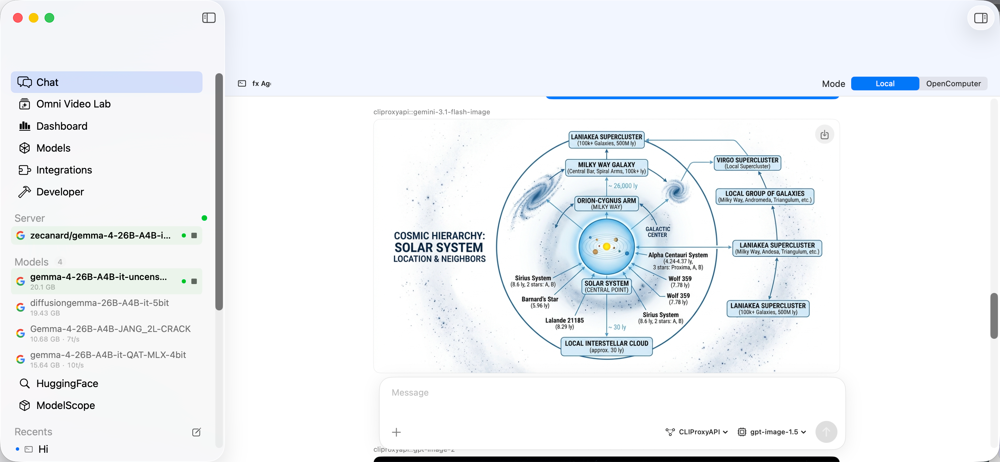
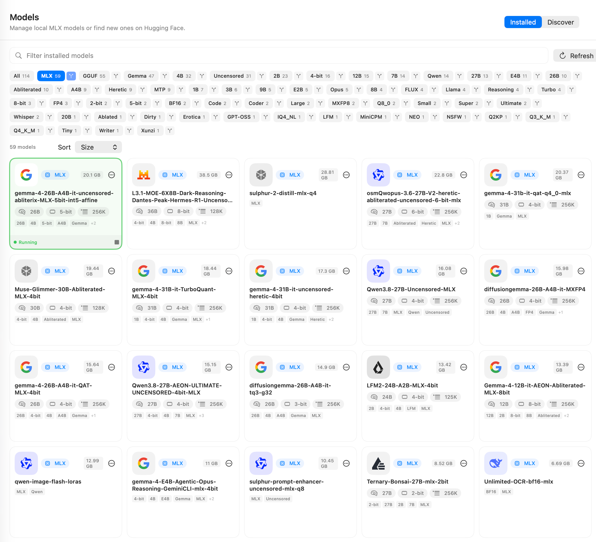
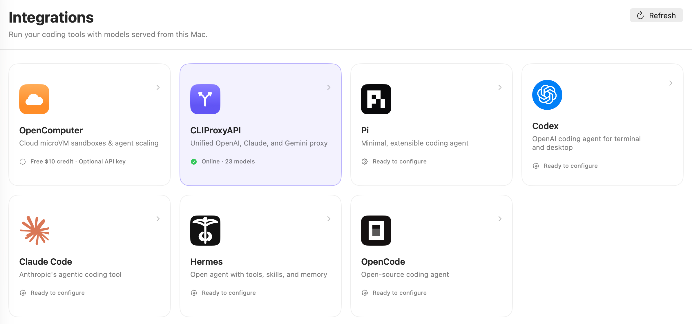
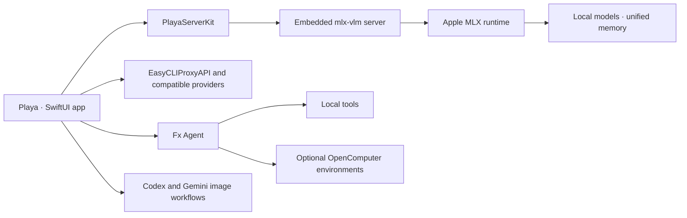

<p align="center">
  
</p>

<h1 align="center">Playa</h1>

<p align="center">
  <strong>A native macOS workspace for local AI models, provider-backed chat, multimodal agents, and conversational image creation.</strong>
</p>

<p align="center">
  <a href="LICENSE"></a>
  
  
  
</p>

Playa turns an Apple Silicon Mac into a private AI model studio and agent workspace. It combines one-click MLX inference, a local model catalog designed for hundreds of models and terabytes of storage, OpenAI-compatible third-party providers, Fx Agent multimodal sessions, and image generation or editing through supported Codex and Gemini models.

<table>
  <tr>
    <td width="50%" valign="top">
      
      <p><strong>Manage model libraries at scale.</strong> Discover local MLX and GGUF models, filter them with automatic tags, compare disk usage, and launch compatible models from one native workspace.</p>
    </td>
    <td width="50%" valign="top">
      
      <p><strong>Connect models to the tools you already use.</strong> Configure provider-backed chat, coding agents, OpenComputer environments, and OpenAI-compatible integrations without leaving Playa.</p>
    </td>
  </tr>
</table>

## Highlights

### One-click local MLX inference

Load and serve compatible local models without assembling a Python environment by hand. Playa embeds an `mlx-vlm` runtime, exposes OpenAI- and Anthropic-compatible local APIs, and provides live health and performance metrics.

### TB-scale local model library

Playa can discover models in Hugging Face caches and user-selected local directories. The library is designed for collections containing hundreds of open models and more than a terabyte of files.

- Automatic family, capability, format, and modality tags
- Search and tag-based filtering
- Sorting by on-disk size, name, recency, and measured performance
- Local downloads, progress tracking, history, launch, and removal controls
- MLX and compatible local model discovery

### Local and third-party providers

Use a model running directly on your Mac or connect an OpenAI-compatible provider. EasyCLIProxyAPI integration supports editable base URLs and API keys, OAuth-backed upstream providers, model discovery, model-list caching, and a selectable default model.

### Fx Agent and classic chat

Choose between a normal streaming conversation and Fx Agent sessions. Fx Agent supports multimodal context, local tools, and an optional OpenComputer-enhanced execution mode for isolated remote environments.

### Conversational image generation and editing

Select supported Codex or Gemini image models directly from the conversation workflow. Generate an image from text, attach references for iterative editing, and view returned image results inline without leaving the session.

### Local analytics and developer tools

Inspect token usage, time to first token, decode speed, memory usage, request history, server health, endpoints, and logs from the native interface.

## Architecture



## Requirements

### Running Playa

- Apple Silicon Mac
- macOS 26 or newer
- Enough unified memory and disk space for the selected models

### Building from source

- Xcode with the macOS 26 SDK
- [XcodeGen](https://github.com/yonaskolb/XcodeGen)
- Python 3
- [Zig](https://ziglang.org/) and a local checkout of [vercel-labs/fx](https://github.com/vercel-labs/fx) at `../fx`, or `PLAYA_FX_SOURCE_ROOT` pointing to it
- Network access during the first embedded-runtime build

## Community download

The `v0.3.5` release includes `Playa-0.3.5-macos-arm64-unnotarized.dmg`, an ad-hoc-signed Apple Silicon community build containing the complete offline MLX and MLX-VLM Python runtime. It is **not notarized by Apple**, so macOS Gatekeeper may block the first launch. Verify the published SHA-256 checksum, copy Playa to `/Applications`, then Control-click the app and choose **Open**. See the release notes for the full security notice.

## Build from source

```sh
git clone https://github.com/jasonet/Playa.git
cd Playa
brew install xcodegen zig

git clone https://github.com/vercel-labs/fx.git ../fx
make xcode-build
open build/XcodeDerivedData/Build/Products/Debug/Playa.app
```

The first build assembles a relocatable Python environment for the embedded server and can take substantially longer than later builds.

Machine-specific signing configuration belongs in `Configuration/Signing.local.xcconfig`, which is intentionally ignored by Git. Do not place signing identities, team IDs, private update keys, or API credentials in tracked files.

Example local override:

```xcconfig
PLAYA_BUNDLE_IDENTIFIER = com.example.Playa
PLAYA_SERVER_KIT_BUNDLE_IDENTIFIER = com.example.PlayaServerKit
DEVELOPMENT_TEAM = YOUR_TEAM_ID
```

Unsigned development builds can be produced with:

```sh
xcodebuild \
  -project Playa.xcodeproj \
  -scheme Playa \
  -configuration Debug \
  -derivedDataPath build/XcodeDerivedData \
  CODE_SIGNING_ALLOWED=NO \
  build
```

## Local API

By default, Playa serves on `http://127.0.0.1:8080`. With a model selected:

```sh
curl http://127.0.0.1:8080/v1/chat/completions \
  -H 'Content-Type: application/json' \
  -d '{
    "model": "your-model-id",
    "messages": [{"role": "user", "content": "Hello from Playa"}],
    "stream": false
  }'
```

If server authentication is enabled, add `Authorization: Bearer your-api-key`.

## Project layout

```text
Sources/
├── Playa/                       # SwiftUI application
└── PlayaServerKit/              # Embedded server lifecycle and Swift clients
PythonDistribution/
├── Launcher/                    # Relocatable server launcher
├── Overlay/                     # Playa server extensions
├── Requirements/                # Pinned Python dependencies
└── Scripts/                     # Runtime assembly and verification
Configuration/                   # App metadata and public signing defaults
scripts/                         # Build, archive, signing, and regression checks
website/                         # GitHub Pages source
project.yml                      # XcodeGen project definition
```

## Security and privacy

Local inference stays on the Mac after model files and dependencies have been downloaded. Requests sent to a configured third-party provider are subject to that provider's policies. Playa does not include provider API keys, Apple signing credentials, or private update-signing keys in this repository.

See [SECURITY.md](SECURITY.md) for vulnerability reporting.

## Contributing

Contributions are welcome. Read [CONTRIBUTING.md](CONTRIBUTING.md) before opening a pull request.

## License and attribution

Playa is available under the [MIT License](LICENSE). The project is derived from the Nativ codebase originally created by Prince Canuma; its original copyright notice is preserved in the license.
